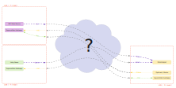
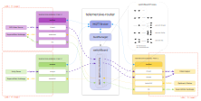
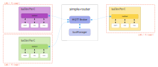
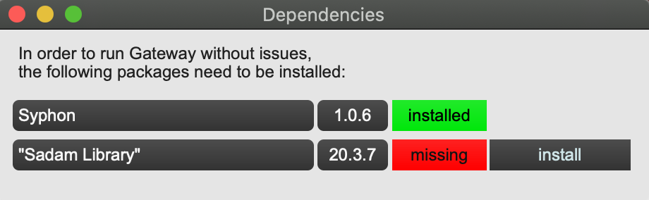
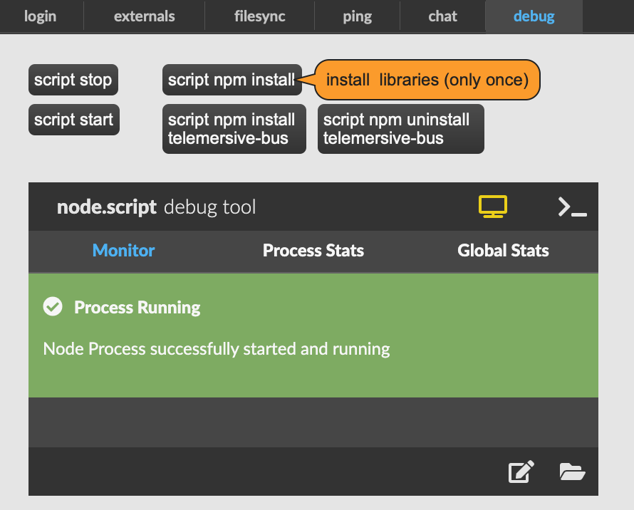
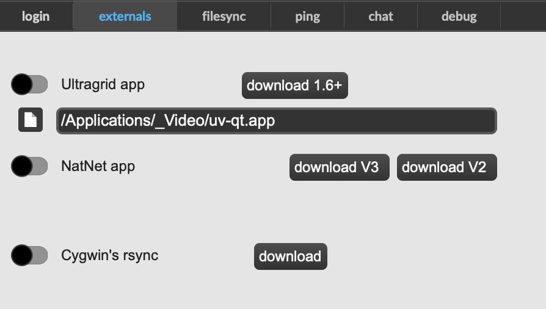
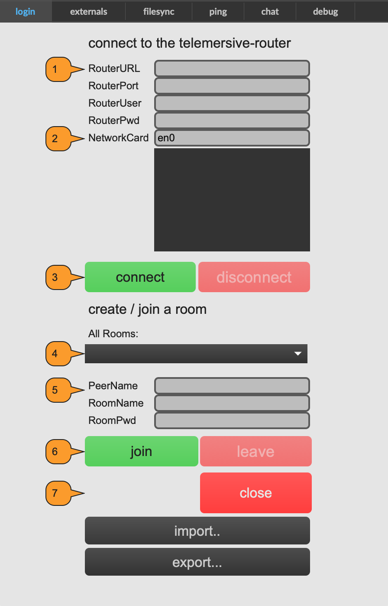
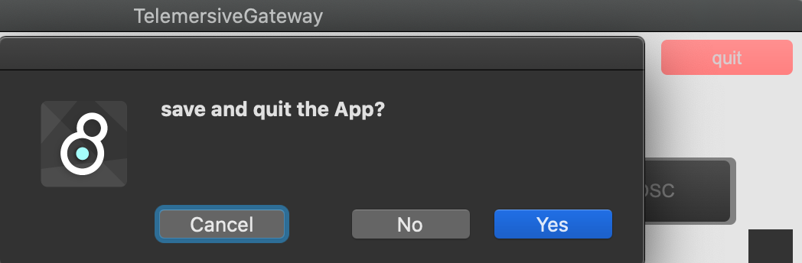

# Telemersive Gateway 1.0.0

Telemersive Gateway is a peer application based on MaxMSP. It allows to converse with multiple peers in different networks. A central server (called the telemersive-router) allows to create virtual rooms inside which all peers can share their available resources.

## Problem

Here a short explanation of the problem the temersiveGateway tries to solve.



Lets assume you have three locations with three indivdual networks (LAN), each sitting behind a firewall whose administrators have no intention to make any changes whatsowever (for example inside a university).

You are challenged to share different data streams between these locations with as little latency as possible without messing up networking between the individual machines inside the individual LAN's.

## Overview

The telemersive network tools solve this with two components.

A server on which a telemersive-router is running, and for each location and machine a telemersive-gateway to help bridging the firewall.



At the core of the system lies the telemersive-bus, a nodejs library that helps to connect the individual peers. It allows to create individual rooms into which peers can enter if they know the correct password. Inside each room the telemersive-router opens an array of proxy-scripts, each handling an individual port, for  lowlatency connection of UDP data streams.

This MaxMSP package allows to use the temersive-bus protocol in two differnt flavours:

### The Telemersive Gateway


### The Telemersive busClient



## Installation

### Requirements
You need to have [MaxMSP](https://cycling74.com/) installed. There is no need for a license if you just want to work with telemersive-gateway.

Additionaly you need the following packages:
* Sadam Objects
* Zero
* Spout / Syphon
* shell

### Download
To install the Telemersive Gateway: clone the gitlab repository into a directory called 'telemersive-gateway'. It is important, that the directory is called this way, otherwise the MaxProject will not work:

```
git clone https://gitlab.zhdk.ch/telemersive-bus/telemersive-gateway.git
```

### Startup for the first time
1. open MaxMSP
2. Go to File > Open.. and navigate to 'telemersive-gateway.maxproj'
3. Inside the new Project Window locate 'TelemersiveGateway.maxpat' and double click it
4. You might be confronted with different popup windows mentioning missing dependencies:
    * Missing MaxPackages like
    
      * Spout (on Windows) or Syphon (on OSX)
      * Sadam Libraries
      -> simply follow the 'install' button.
    * Missing NodeJS Libraries -> the [config] window should be already open > go to tab 'debug' and press 'script npm install'. Once the debug tool turns from blue to green, you are good to go.
    

5. If you want to get videostreams or synchronize your files: set paths to externals > tab 'externals'.
    *  For enabling videostreams you need to download Ultragrid and point the app to the ultragrid app.
    * **Windows only:** For synching files on windows you need to have cygwin installed. During the installation process, make sure you install 'rsync', which is not installed by default. On OSX this is installed by default.
    * **Windows only:** If you want to send Mocap data from Motive (Optitrack), you need the NatNet2OSC apps. Motive 2.x will work with NatNet3. If you only want to receive data, there is no need for this external.
    


### Login



1. Enter your credentials under the tab 'login'. This infos are confidential and are only provided on a need to know basis.
    * Router URL:  e.g. 'telematics.zhdk.com'
    * Router Port: e.g. '1883'
    * Router User: e.g. 'peer'
    * Router Pwd: e.g. '*******'
2. Network Card: If your machine has more than one network card available, you will have to choose which one you want to use.
3. press 'connect'

If the connection is successful, the red 'disconnect' button gets highlighted and the green 'connect' button greyed-out.

4. Once you are connected, you can now see all the available rooms to join.
5. Enter your room credentials.
    * Enter your PeerName
    * Select a room from the menu or enter a room name.
    * Enter the room password

If the room you enter doesn't exist, a new room will be created and the password will be set as the room password. The password cannot be changed anymore, only once every peer has left the room, the room manager (a service of the telemersive-router) removes the room and again a new room with the same name but with a new password can be created.

6. press 'join'

If the room join is successful, the red 'leave' button gets highlighted and the green 'join' button greyed-out.

7. press 'save' to save all the credentials for your next login. Save also stores your local device settings.

press 'close' to close the [config]-window.

### Closing the app
press the 'quit' button in the upper right corner



You will be presented with a choice:

'cancel' will cancel the process.
'No' will quit the app **without** saving the current state.
'Yes' will quit the app **after** saving the current state.

### FAQ

* Using ultragrid, I want to send a Spout stream, but the receiver only gets a black texture.
  * Check the local Spout settings. The local machine needs to be able to share textures via GPU (a dedicated GFX-Card). In some instances it was enough to simply open the spout settings (located at C:\Program Files\SPOUT-2007\SPOUTSETTINGS) and confirm with 'OK'
* I am sending a stream, and one machine receives the stream and the other is not.
  * Check the firewall. Both Windows and OSX will request a confirmation if a network connection is started (usually only once for each channels).
    * Windows: Settings > Update & Security > Windows Security > Firewall and Network protection > Allow an app through the firewall
      * look for 'NatNetThree2OSC' and 'uv_tb0' .. 'uv_tb9'
    * OSX: System preferences > Security & Privacy > Firewall > Firewall Options
      * look for 'uv-qt'
