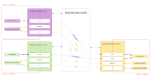
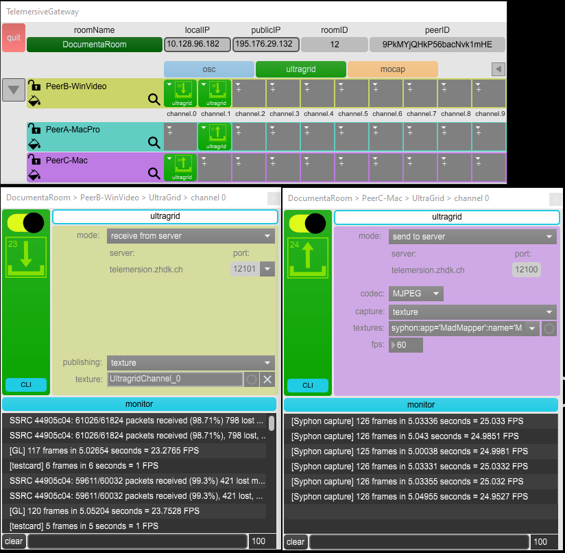

# Telemersive Gateway 8.1.2

Telemersive Gateway is a peer to peer application based on MaxMSP. It allows to converse with multiple peers in different networks. A central server (called the [telemersive-router](https://github.com/telemersion/telemersive-router)) allows to create virtual rooms inside which all peers can share their available resources.

## Features

The gateway comes with an easy to use GUI to give an overview of all the peers participate inside the same room.

For each connection type it shows a matrix of all channels available, with icon indicators in which direction the data flows and framerates if available.

It is possible to remote control the connections of each peer from another peer. If the connection is utilizing a CLI app like ultragrid or NatNet2OSC, it is possible to monitor the logout of these apps even from a remote peer to investigate problems.

The Userinterface makes the configuration of the CLI apps very simple and user friendly.

For more information please visit  the [documentation](https://github.com/telemersion/telemersive-gateway/wiki).

For issues, please report them [here](https://github.com/telemersion/telemersive-gateway/issues).

## Installation

### Requirements
You need to have [MaxMSP](https://cycling74.com/) installed. There is no need for a license if you just want to work with telemersive-gateway.

### Download
To install the Telemersive Gateway: download the [latest release](https://github.com/telemersion/telemersive-gateway/releases) and drop the unpacked folder inside the [MaxMSP package folder](https://docs.cycling74.com/max8/vignettes/packages) and call it 'telemersive-gateway'. It is not important that the directory is called this way, but otherwise the MaxProject will not work.

Restart Max. Now you should be able to find the telemersive-gateway package inside the package manager.

### Dependencies
The easy way to install all dependencies: open the package launcher and follow the instructions.

The telemersive-gateway requires additional MaxMSP packages.

* Zero
* Spout / Syphon

It also needs a local installation of

* [Ultragrid](https://www.ultragrid.cz/), an opensource video networking framework with extremely low latency. If you want to interface it with NDI, you need also to install the [NDI libraries](https://github.com/CESNET/UltraGrid/wiki/Syphon,-Spout-and-NDI#ndi) for your system.
* [NatNetThree2OSC](https://github.com/tecartlab/app_NatNetThree2OSC),  an opensource app to convert native [optitrack](https://optitrack.com/software/) tracking data to OSC. (windows only)

Make sure MaxMSP has read-write access rights on the folders ultragrid and NatNet2OSC reside in.

## Credits

Martin Froehlich (c) 2023 [Immersive Arts Space](http://immersive-arts.ch)

Telemersive-gateway is developed in the research project Spatial Dis-/Continuities in Telematic Performances. It is one element of our toolset to enable remote locations to create overlapping spaces on physical and virtual stages.

